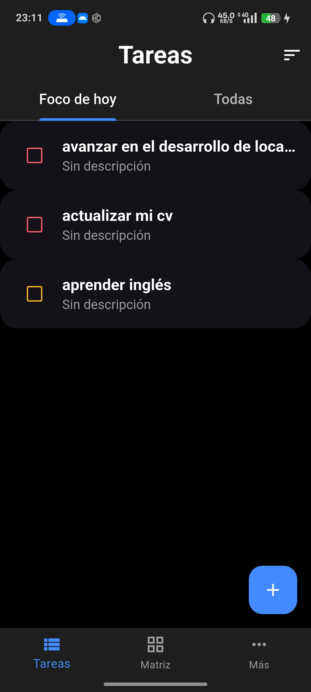
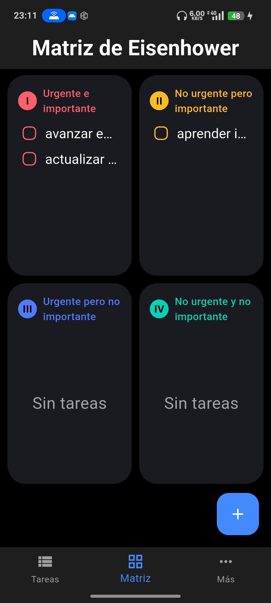
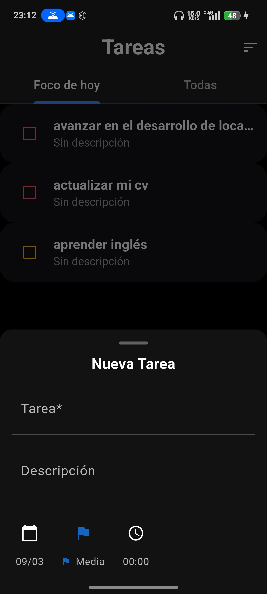
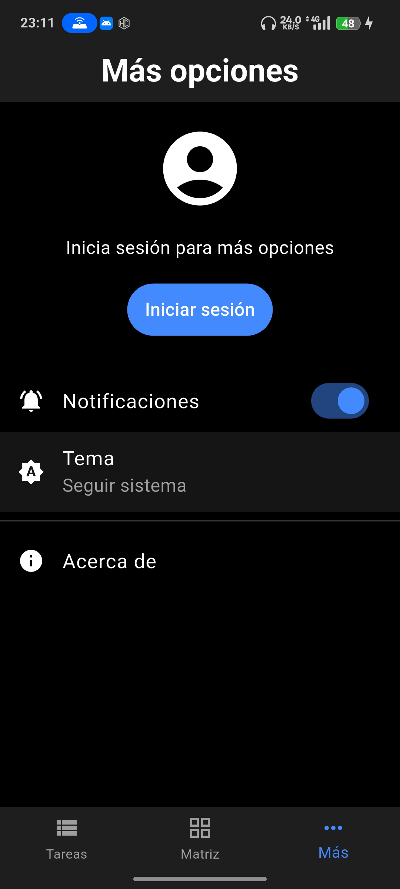

# Avas Eto

[](https://flutter.dev)
[](LICENSE)
[](#plataforma-soportada)

Aplicacion de gestion de tareas construida con Flutter, enfocada en planificacion diaria y priorizacion usando lista y Matriz de Eisenhower.

## Alcance actual

- Crear tareas con titulo, descripcion, prioridad, color, fecha y hora.
- Editar, eliminar y marcar tareas como completadas.
- Visualizar tareas en dos formatos:
    - Lista por pestanas: `Pendientes` y `Completadas`.
    - Matriz de Eisenhower (4 cuadrantes).
- Ordenar tareas por prioridad o por fecha reciente.
- Busqueda de tareas por texto.
- Recordatorios y notificaciones locales para tareas programadas.
- Persistencia local de tareas y sincronizacion cuando hay conectividad.
- Soporte de autenticacion (incluyendo Google Sign-In).
- Navegacion principal con `Tareas`, `Matriz` y `Mas`.
- Tema claro y oscuro aplicado a componentes clave (dialogs, date/time pickers, tarjetas y navegacion inferior).
- Pantalla `Acerca de` con resumen funcional y politica de privacidad.

## Requisitos

- Flutter SDK 3.7.0 o superior
- Dart SDK
- Android Studio (entorno recomendado para desarrollo y ejecucion)

## Plataforma soportada

- Android

## Instalacion

1. Clonar repositorio

```bash
git clone https://github.com/cvc953/avas-eto.git
cd avas-eto
```

2. Instalar dependencias

```bash
flutter pub get
```

3. Ejecutar la app

```bash
flutter run
```

## Estructura principal

```text
lib/
    controller/      # Logica de estado y reglas de negocio
    dialogs/         # Crear/editar tarea
    models/          # Entidades (ej. tarea)
    repositories/    # Acceso a datos
    screens/         # Pantallas principales
    services/        # Auth, almacenamiento, notificaciones, conectividad
    theme/           # Definicion de temas de la app
    utils/           # Helpers y utilidades
    widgets/         # Componentes reutilizables
```

## Flujo de uso

1. Crear una tarea desde el boton flotante en `Tareas` o `Matriz`.
2. Revisar tareas en lista o en la Matriz de Eisenhower.
3. Marcar tareas completadas o editarlas desde sus opciones.
4. Usar `Mas` para opciones adicionales y pantalla `Acerca de`.

## Capturas de pantalla

| Pantalla | Vista |
| --- | --- |
| Tareas |  |
| Matriz Eisenhower |  |
| Dialogo crear/editar |  |
| Opciones / Acerca de |  |

## Novedades recientes

- Reorden de la barra inferior a `Tareas`, `Matriz`, `Mas`.
- Ajuste de colores en tema claro para tarjetas y barra de navegacion inferior.
- Aplicacion del tema en selectores de fecha y hora.
- Ajustes de estilo en dialogos de confirmacion (incluyendo botones de accion).
- Correccion de visibilidad del dia actual en el date picker.
- Actualizacion de la pantalla `Acerca de` con alcance funcional y privacidad.

## Politica de privacidad (resumen)

- La app procesa datos de tareas y configuraciones necesarias para su funcionamiento.
- La informacion se usa para organizacion, visualizacion y recordatorios.
- Los datos pueden almacenarse localmente y sincronizarse con cuenta autenticada.
- No se comercializan datos personales para publicidad.
- El usuario puede editar o eliminar su informacion desde la app.

## Comandos utiles

```bash
flutter run --debug
flutter test
flutter build apk
flutter build appbundle
```

## Licencia

Proyecto bajo licencia MIT. Ver `LICENSE`.

## Autor

Cristian Villalobos Cuadrado
